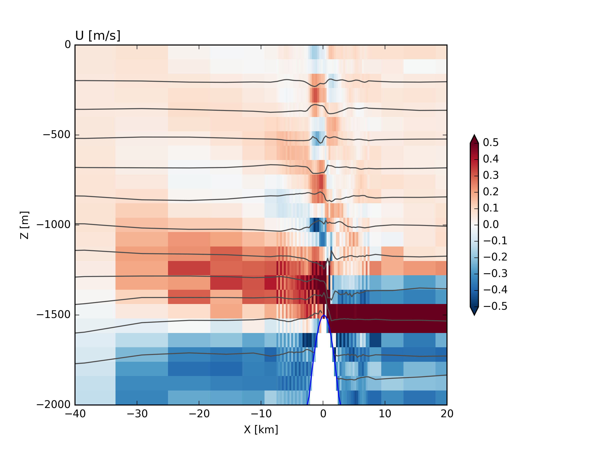

# Example MITgcm setup for steady stratified flow over Gaussian Bump



  - `./code/` contains modified code
  - `./input/` contains the `data*` files and the python script to generate the data sets
  - `./build_options/` contains the compiler flags form macOS 10.
  - `build` is a placeholder for where the gcm should be built
  - `runs` is where you might keep model output.

## Installing the stuff we need

Have a look at [this Page](./install.html)

## Setting up

### Compiling

'./build' is where we compile the gcm.  To compile you should run:

```
 /Users/jklymak/MITgcmc66b/MITgcm/tools/genmake2 \
  -optfile=../build_options/darwin_brewgfortranmpi -mods=../code/ \
   -rootdir=/Users/jklymak/MITgcmc66b/MITgcm
```

then `make depend` followed by `make`

### Changing domain size

  1. Change `code/SIZE.h` and recompile.
  2. Change `input/gendata.py` and rerun `python gendata.py`.  It would be good practice to make a new name for the run at this point.
  3. If using open boundaries change `input/data.obcs` i.e. `OB_Jnorth=80*0,` where in this case `ny=80`

### Changing other parameters

  1. Edit  `gendata.py`.  For new runs it is best to change the value of `outdir` right away.

### Running


**Generate the data**

In `./input`, run `python gendata.py`.  

Note that this writes many files in `../runs/RunFr216`.  This is where we will run the model from.  Why do we move it?  Because we often want a number of runs that are similar, and this ensures reproducibility.  In addition to creating the files we need some plots are made into `../runs/RunFr216/figs/` that are often useful to make sure we did what we wanted, and the './input',  './code',  './build_options', and  './analysis', directories are saved into this directory as well.  These essentially ensure that the model can be rerun even if the data is removed.

**Run the model**

Now we can execute the model:
```
mpirun -np 4 ../../build/mitgcmuv
```
where `-np 4` means we want 4 processors (as also specified in `code/SIZE.h`)
